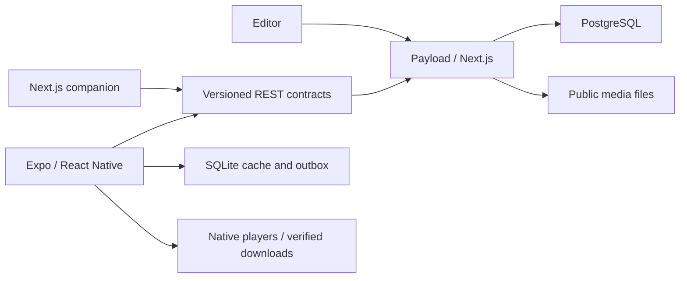

# Bastiat Library

**Ideas worth thinking through.** An independent learning app by Gabriel Pimenta, with an Expo mobile client, a Next.js web companion and a Payload editorial studio.

Explore one original course, three narrated lessons and two readings. Listen, save your place, download a lesson on mobile, and continue on the web with the same account.

> Development preview. Web and simulator checks are recorded in [QA evidence](docs/qa/VALIDATION.md). Physical-device background audio, accessibility and distribution checks remain release gates. There is no public hosted service or store release yet.

## Run locally

Requirements: Node 24, pnpm 10.28.1, PostgreSQL 17, and Xcode or Android Studio for native builds. macOS users with Homebrew PostgreSQL can use the isolated database helper below. Other environments can use `compose.yaml` and set `DATABASE_URL` to that database.

```sh
pnpm install --frozen-lockfile
pnpm run setup
pnpm db:start
pnpm seed
pnpm dev
```

Open `http://localhost:3000` for the library and `/admin` for the editorial studio. The setup script generates credentials in `.local/demo-access.txt`; these are local fixtures, never shared production accounts. It preserves existing configuration. Use `pnpm run setup` explicitly: `pnpm setup` is pnpm’s own shell setup command.

In another terminal:

```sh
pnpm --filter @bastiat/mobile ios
# or, with an Android emulator running:
pnpm --filter @bastiat/mobile android
```

These commands build a development client. A plain Expo Go session does not exercise the app’s native configuration. iOS Simulator uses localhost; Android Emulator uses `10.0.2.2`. For a physical device, set `EXPO_PUBLIC_API_URL` in `apps/mobile/.env.local` to your computer’s LAN URL. Release builds require a reachable HTTPS API. See [release procedure](docs/RELEASE.md).

## What is implemented

- Public catalog, search, format filters, bounded server pagination and editorial selections.
- Course and reading pages with original illustrations, transcripts and source links.
- Native audio, foreground video, seeking, playback speed and explicit lesson completion.
- Foreground mobile downloads with a queue, cancellation, retry, free-space checks and SHA-256 verification before availability.
- SQLite persistence, cached public content and an account-scoped synchronization outbox.
- Idempotent progress writes with server revisions. Concurrent changes preserve both positions and ask the reader to choose; rewinding is a valid action.
- Payload drafts and roles, server-derived ownership, HttpOnly web sessions and SecureStore mobile tokens.
- A shared web study experience with real audio/video and cross-session resume.

Guest data stays separate when signing in. Signing out revokes the server session and removes that account’s local study data, so it requires connectivity. Public downloaded media remains on the device. Bookmarks use explicit save/remove operations and last-arriving-write semantics; progress uses revision conflicts.

## Architecture



| Location                 | Responsibility                                                         |
| ------------------------ | ---------------------------------------------------------------------- |
| `apps/mobile`            | Native screens, media, downloads, SQLite and secure sessions           |
| `apps/web`               | Payload collections, access control, transactional REST API and web UI |
| `packages/contracts`     | Zod contracts, API client and synchronization state machine            |
| `packages/design-tokens` | Shared palette and spacing                                             |
| `content`                | Original editorial material, generated media and license records       |
| `tests`, `.maestro`      | Domain, API, browser and native test flows                             |

Decisions: [native media](docs/adr/001-native-media.md), [offline synchronization](docs/adr/002-offline-sync.md), [CMS contracts](docs/adr/003-cms-contracts.md).

## Validation

```sh
pnpm check
pnpm test:api       # requires the seeded, isolated development server
pnpm test:e2e      # starts or reuses the local web server
pnpm build
```

API tests write synthetic fixtures and study records. Run them against a disposable development database. Native flows require an installed development build and a reachable API; the offline/restart procedure is documented in [QA](docs/qa/VALIDATION.md). The GitHub workflows define automated gates; [the tracker](docs/IMPLEMENTATION.md) distinguishes configured checks from checks actually run.

## Boundaries and trade-offs

The demo has public, licensed media, pre-provisioned accounts and one dark palette. It has no DRM, payments, advertising, analytics service, email delivery, password-recovery UI, social login or AI assistant in the product. Video pauses in the background. Downloads run in the foreground; interrupted partial files restart from the beginning. Each download is limited to 64 MB because checksum verification reads the file into memory. The initial storage adapter uses local server disk and needs a persistent volume in a hosted deployment.

Session expiry requires signing in again; no background token renewal is claimed. Removing a published item does not remotely erase previously cached public content. Native updates use an app-version runtime policy; no OTA rollout is configured.

## AI-assisted engineering and licensing

Implementation uses Codex with executable checks and documented findings. [Contribution policy](docs/IMPLEMENTATION.md#engineering-and-ai-contribution-policy), [agent instructions](AGENTS.md) and [engineering record](docs/ai/2026-09-21.md) describe the workflow. AI output and automated passing checks do not constitute a maintainer’s release approval.

Code is MIT licensed. Original scripts, readings, illustrations and generated narration are CC BY 4.0; third-party licenses are listed in [CONTENT_SOURCES.md](CONTENT_SOURCES.md). Narration is synthetic and is not a recording of Frédéric Bastiat. This project is not affiliated with the Ayn Rand Institute or a publisher.
