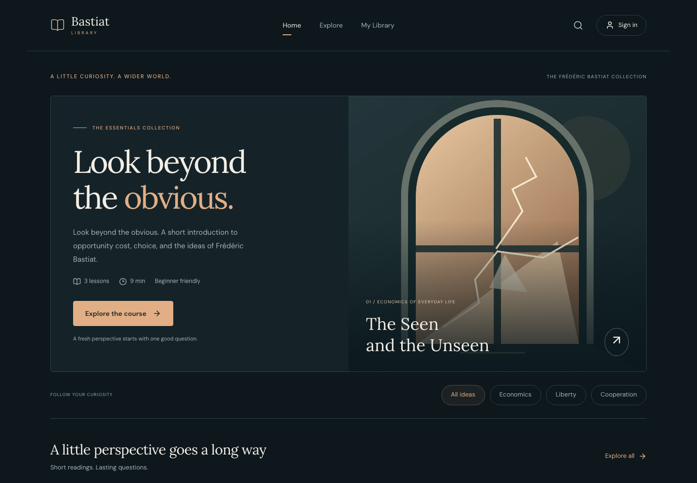
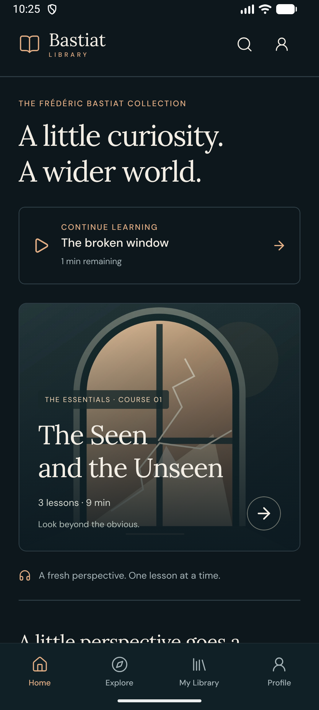
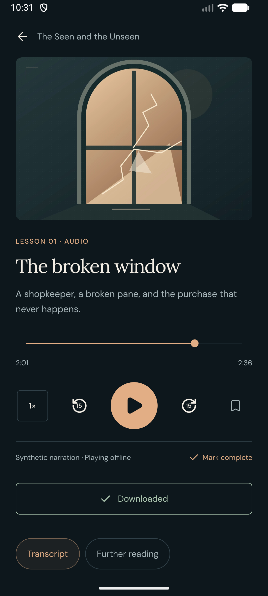
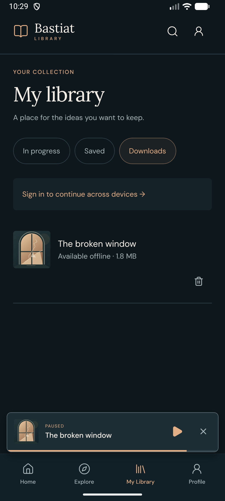
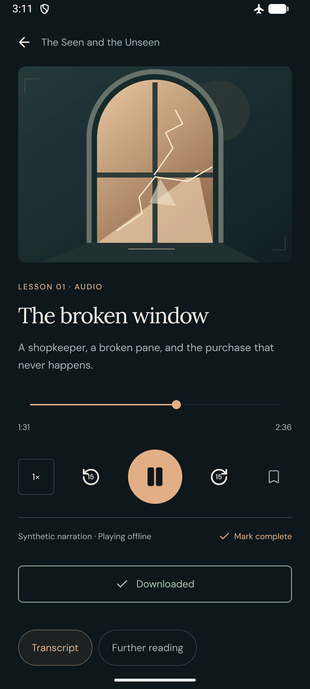
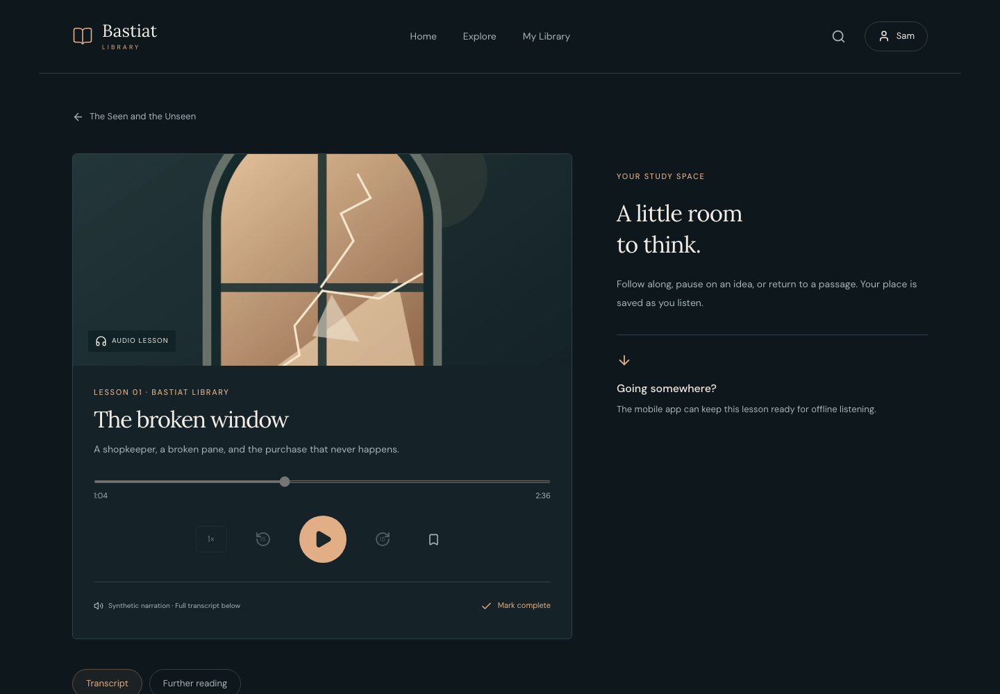
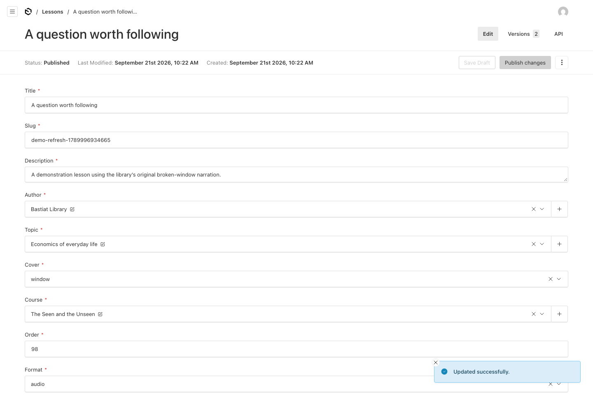

# Demonstration

[Watch the 1 minute 57 second demonstration](media/demonstration.mp4).

The video uses actual screen captures from application source `3c98567`: the local Next.js companion and Payload studio, and an Android Emulator running a Release configuration APK with bundled JavaScript. It is silent, edited, and presented at normal speed. Chapter titles and cuts are added; startup waits are omitted. This is a development preview using a local API.

The studio publishes a temporary draft that reuses the project's original narration, then the web opens that published lesson. The Android clips show the seeded course, playback, a newly verified download, and playback after a process restart in airplane mode with Wi-Fi disabled. Those Android clips use guest data. The web resume clip uses the same synthetic account as the separately verified iOS Simulator checkpoint. The closing card reports separate physical iPhone tests; it is not a recording of those tests. See [the evidence report](qa/VALIDATION.md) for devices, build revisions, failures and remaining checks.

Temporary server lessons were removed after validation. No demo credentials, device identifiers or provisioning profiles are included in the recording or repository.

## Latest visual pass

[Updated web and native screenshots](qa/VISUAL_REVIEW.md) show the subsequent responsive layout review. The video and original screenshots below still document application source `3c98567`.

## Original delivery screenshots

| Mobile collection                              | Native playback                                           |
| ---------------------------------------------- | --------------------------------------------------------- |
|  |  |

| Verified download                                                    | Playback after offline restart                               |
| -------------------------------------------------------------------- | ------------------------------------------------------------ |
|  |  |

