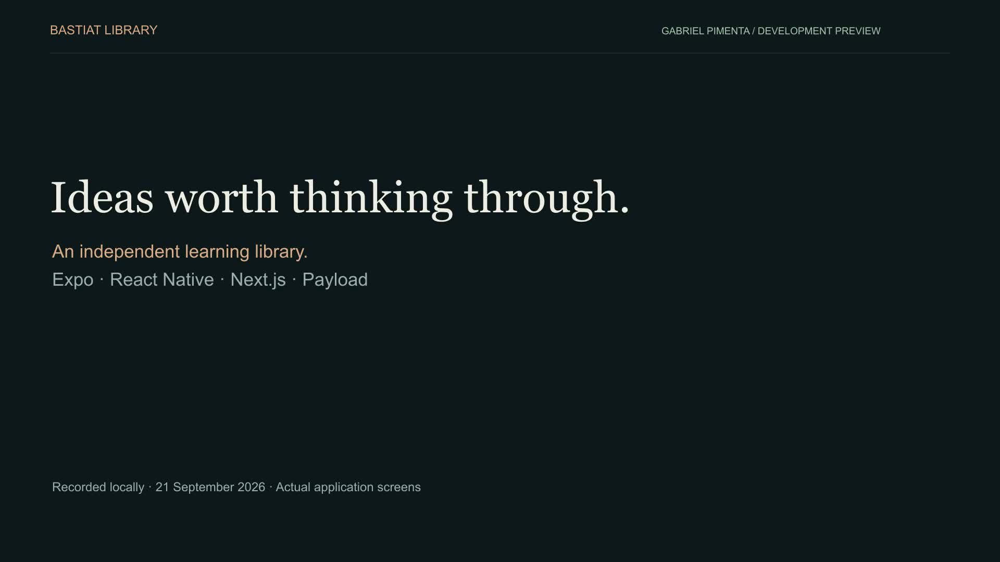
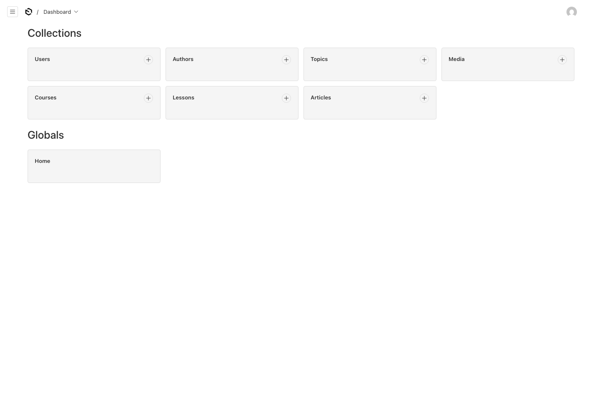

# Demonstration

[Watch the 1 minute 35 second demonstration](media/demonstration.mp4).

A recorded walkthrough of Bastiat Library: explore the web collection, publish a lesson in the editorial studio, browse and download on mobile, listen after an offline restart, and continue with saved progress on the web.

The preview runs locally. Public web/API hosting is deferred until there is interest in a live demonstration. The repository and this recording are the current review package; [local setup](../README.md#run-locally) remains available.

## Recording notes

Refreshed on 21 September 2026 after the responsive visual review was merged. Web and studio captures use source [`095d22d`](https://github.com/Gabrpimenta/bastiat-library/commit/095d22dcbca6143646ef94ee23ed20333224fcd0). Android captures use the Release APK from `e43fefa`, whose mobile and shared-package source matches that merge. See [build identity](qa/ARTIFACTS.md).

The 1920 × 1080 video is silent, edited, and presented at normal interaction speed. Chapter captions, short fades and cuts are added; startup waits and some idle time are omitted. Every application screen is a real capture. No physical device was used for this refresh.

- The studio publishes a temporary draft using the project's original narration, then opens its published page. The fixture was removed afterward.
- Android Emulator footage shows a fresh verified download, native playback and seeking, and downloaded playback after force-stopping and reopening with airplane mode enabled and Wi-Fi disabled. These clips use guest data. Connectivity and volume were restored, and playback was stopped.
- The web resume clip uses the synthetic account with an existing synchronized iOS Simulator checkpoint. Before recording, the current web player resumed at 74 seconds, matching the stored native checkpoint of 74.365 seconds. This is a fresh comparison of existing progress, not a new recording of native-to-web synchronization. The earlier end-to-end synchronization test is documented in [QA](qa/VALIDATION.md).

No passwords, tokens, device identifiers or provisioning profiles are included. Physical iPhone acceptance remains separate historical evidence. See [refresh verification](qa/DEMO_REFRESH.md) for capture checks and limitations.

## Chapters

| Time | Scene                                          |
| ---- | ---------------------------------------------- |
| 0:00 | Introduction                                   |
| 0:04 | Web collection, course, search and reading     |
| 0:20 | Editorial dashboard and real draft publication |
| 0:31 | Native collection and course                   |
| 0:45 | Fresh media download and verification          |
| 1:02 | Native playback and seeking                    |
| 1:07 | Playback after an offline restart              |
| 1:22 | Resume saved progress on the web               |
| 1:30 | Repository and closing card                    |

## Current screenshots

| Mobile collection                              | Native playback                                           |
| ---------------------------------------------- | --------------------------------------------------------- |
|  |  |

| Verified download                                                    | Playback after offline restart                               |
| -------------------------------------------------------------------- | ------------------------------------------------------------ |
|  |  |

See the [compact web player](media/web-compact.png) and [visual review](qa/VISUAL_REVIEW.md) for additional screenshots, screen coverage and responsive-layout checks.
