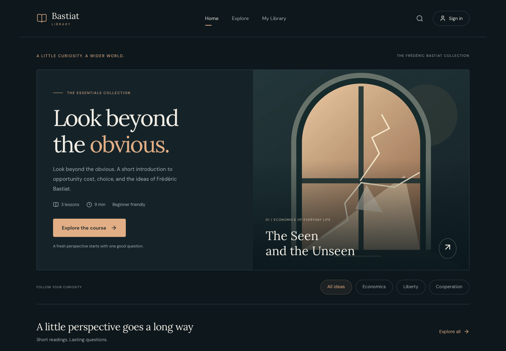
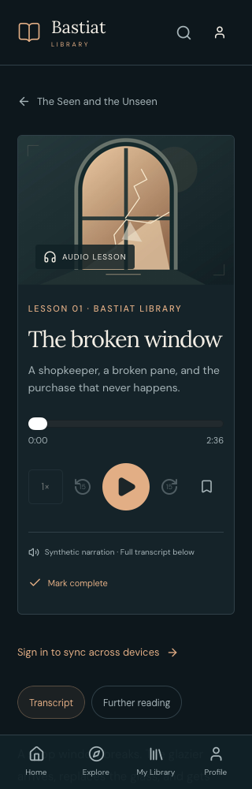
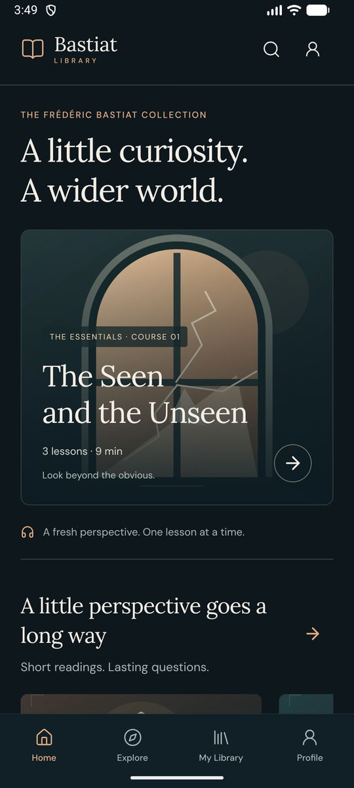
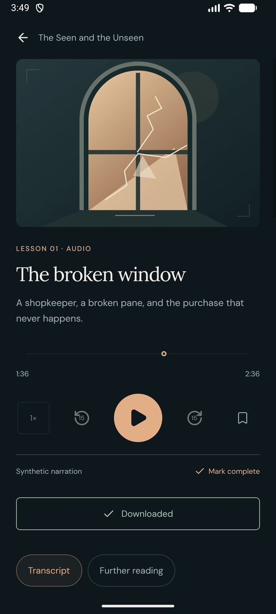

# Web and native visual review

21 September 2026. This pass used browsers, iOS Simulators and an Android Emulator only. Physical-device evidence in the main QA report belongs to the earlier media acceptance runs.

## Changes

At 320 px the web lesson panel clipped its Save button. The controls now fit inside the panel and keep their touch targets. Compact headings and image proportions scale with the viewport; tablet catalogs use two columns; card metadata and save actions align along each row. The search field has one focus boundary, mobile inputs use 16 px text, and the icon-only account link has an accessible name.

Native screens share a 24-point gutter and a bounded tablet reading width. The home artwork card grows with its text, detail media uses the video's aspect ratio, and detail screens respect the bottom safe area. Text wraps beside icons and actions. The learning-path heading and count stack at larger font sizes; empty states, downloads and the mini-player have more consistent spacing. The missing-page screen can scroll with large text. The existing palette, illustrations and restrained motion are retained.

## Executed checks

| Surface                                | Coverage                                                                                                                                   | Result                                                                                                         |
| -------------------------------------- | ------------------------------------------------------------------------------------------------------------------------------------------ | -------------------------------------------------------------------------------------------------------------- |
| Chromium and WebKit                    | Home, Explore, course, audio lesson, video lesson, reading, Library, Profile, About, Privacy and missing page at 320, 390, 820 and 1440 px | 88 route/width/browser combinations captured; no horizontal overflow or off-screen elements in the bounds scan |
| Web interactions                       | Player control bounds and saving at 320, 390 and 820 px; empty search, invalid sign-in recovery, paused mini-player                        | Passed; 3 persistent responsive regression tests added                                                         |
| iPhone 17 Pro Simulator, iOS 26.5      | Main tabs, course, audio/video lesson layouts, reading and About; signed-in Profile                                                        | Passed                                                                                                         |
| iPhone Simulator, largest Dynamic Type | Learning-path heading/count, player controls and library sync row                                                                          | Passed after stacking the heading/count; body text scaling remains enabled                                     |
| iPad mini Simulator, iOS 26.5          | Full screen tour, tablet widths, large-text negative sign-in, empty search, missing content and missing-page recovery                      | Passed                                                                                                         |
| Android Emulator, API 36.1             | Release APK with bundled JavaScript; normal and compact 320 dp layouts                                                                     | Passed                                                                                                         |
| Local checks                           | Format, lint, TypeScript, 20 domain tests, 8 browser tests, production web build, Android Release build                                    | Passed                                                                                                         |

`.maestro/visual-review.yaml` captures the native screen tour after asserting each destination and waiting for transitions. `.maestro/media-navigation.yaml` now waits for the initial screen before sending its first deep link. The initial runner occasionally sent a link during startup and captured Home instead of the target. Early captures without destination/animation waits were superseded. A new iPad development client also required dismissing its onboarding and the OS password-save prompt; these setup failures are not application passes.

The updated Android Release also passed video/audio play, seek and pause, mini-player resume/pause/close, and the downloaded-library view. Playback was muted for this pass.

The raw captures and logs are retained locally under `.local/visual-review/`. The representative images below are actual app captures, resized or cropped only for presentation. The earlier demonstration video remains associated with its original source revision.

## Representative screens

| Compact web player                                    | Android Release home                              | Android Release player                                |
| ----------------------------------------------------- | ------------------------------------------------- | ----------------------------------------------------- |
|  |  |  |

This is a visual and interaction review, not a complete screen-reader or physical-device performance audit.
